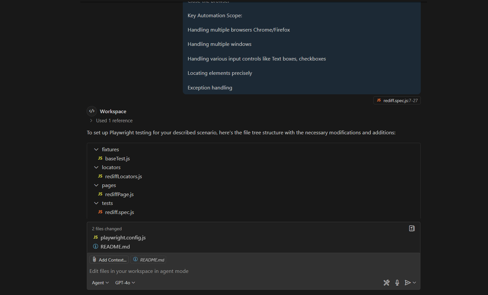

# Playwright MCP Server 🎭

A Model Context Protocol server that provides browser automation capabilities using Playwright. This server enables LLMs to interact with web pages, take screenshots, generate test code, web scraps the page and execute JavaScript in a real browser environment.


### Features of Playwright MCP Server
- **Browser Automation**: Automates browser actions using Playwright.
- **Context Management**: Defines and manages contexts for locators, pages, and tests.
- **Scalability**: Enables easy scaling of test frameworks.


# Screenshots

#### Instructions



## Overview
This project is built using Playwright for end-to-end testing of web applications. It includes tests for handling multiple windows, validating page elements, and saving data in JSON format. The project is structured to ensure modularity and scalability, with separate files for locators, pages, fixtures, and tests.

## Features
- **Multiple Window Handling**: Tests include switching between parent and child windows.
- **Link Extraction**: Extracts all links from a webpage and saves them in JSON format.
- **Page Validation**: Validates the presence of specific elements and page titles.
- **Exception Handling**: Robust error handling for unexpected scenarios.

## Project Structure
```
├── fixtures
│   └── baseTest.js
├── locators
│   └── rediffLocators.js
├── outputs
│   └── links.json
├── pages
│   └── rediffPage.js
├── tests
│   └── rediff.spec.js
├── tests-examples
│   └── demo-todo-app.spec.js
├── playwright.config.js
└── README.md
```


## Running Tests
1. Run all tests:
   ```bash
   npx playwright test
   ```
2. Run a specific test:
   ```bash
   npx playwright test tests/rediff.spec.js
   ```

## Generating Reports
- HTML Report:
  ```bash
  npx playwright show-report
  ```

## Key Files
- **playwright.config.js**: Configuration file for Playwright.
- **tests/rediff.spec.js**: Contains tests for the Rediff application.
- **pages/rediffPage.js**: Page object model for the Rediff application.
- **outputs/links.json**: Stores extracted links in JSON format.


